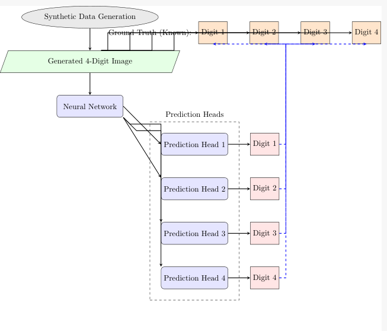
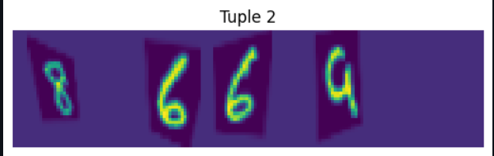
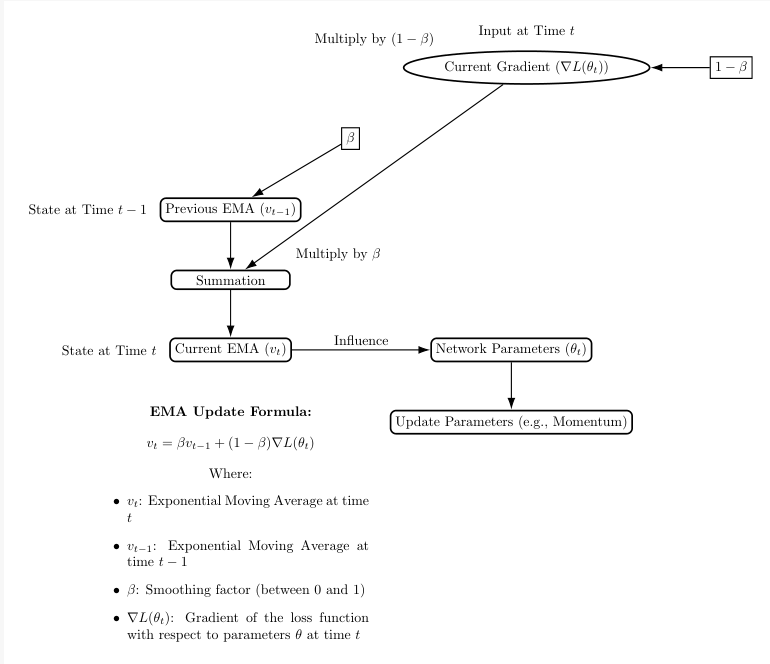
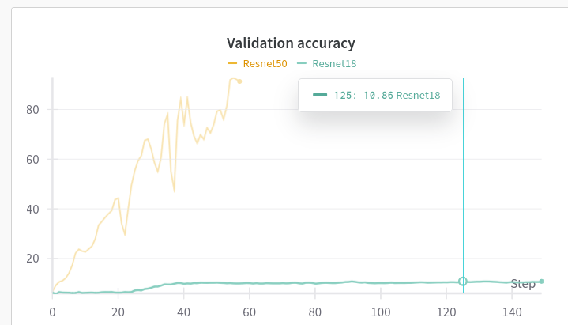
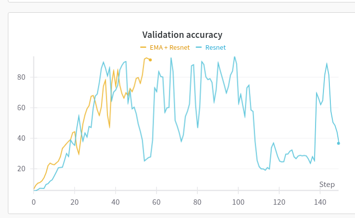
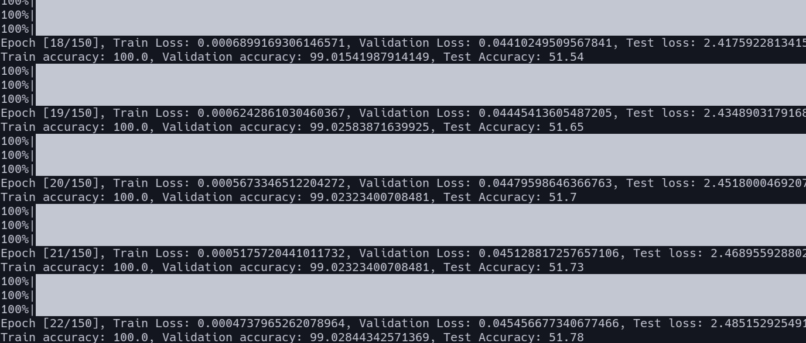

# MLNS-1

### Model

1. A Resnet50/Resnet101 model for all classes 0-36 (all possible sums)
2. A ResNet model trained to predict each digit separately trained on synthetic data.

### Extra additions

- **Synthetic data** - Since our data is not enough (only 10k examples) we can generate synthetic dataset to improve performance and since we can generate data ourselves we have also information of what individual digit is.
    

    

- **EMA (Exponential moving average)** - We can observe that training procedure is not stable. So we introduce EMA to enable more stable training.

### **Results:**

- Baseline = ~10%
- Resnet50 trained from scratch = ~30%
- Resnet50 with EMA = ~90%
- Resnet50/101 trained exclusively on synthetic data = ~50%

### **Observations**

- **Small model vs big model:** We know that big models overfit on the data, and since this dataset is MNIST like (almost trivial) I thought 4 layer Conv network is enough.
    - However experiments show that big (50 layer network) is able to represent complicated distribution (addition is non-trivial) much better than simple models. Even 101 layer network has no fast overfitting.
    - Experiments with Resnet18 show that network is not able to learn at all, which means it is a matter of scale not just architecture
    
    
    
    - **Very unstable training even al small learning rates:** Training is heavily unstable, adding EMA has improved it
    
    
    
- **Regular data vs synthetic data:** Since data is scarse we can generate a bigger synthetic dataset. The big issue is synthetic dataset should be follow distribution of test set. My pipeline can get ~50% accuracy of test set, without ever seeing any example once.
- **Predicting sum vs predicting each digit separately:** The task of predicting final sum can be simplified into predicting 4 digits. Once we have synthetic data, the constraints put on tasks make it easier to approach.
- **Pretrained vs training from scratch:** ResNet initialized from scratch severally underperformed the version trained on ImageNet. Intrestingly the model which gives better performance on ImageNet (and thus overfits on it) is worse on this dataset.
- **Big models do not overfit:** Below image shows model continuing to improve test accuracy on a very different dataset when trained on synthetic dataset even when 100% accuracy and 1e-5 loss is reached.

**Hyperparameters**

- Lr = 0.001
- Weight decay in regularization helps in reducing overfitting
- EMA beta coefficient: 0.99

**Future approach**

- Try combining synthetic data loss, with real dataset.
